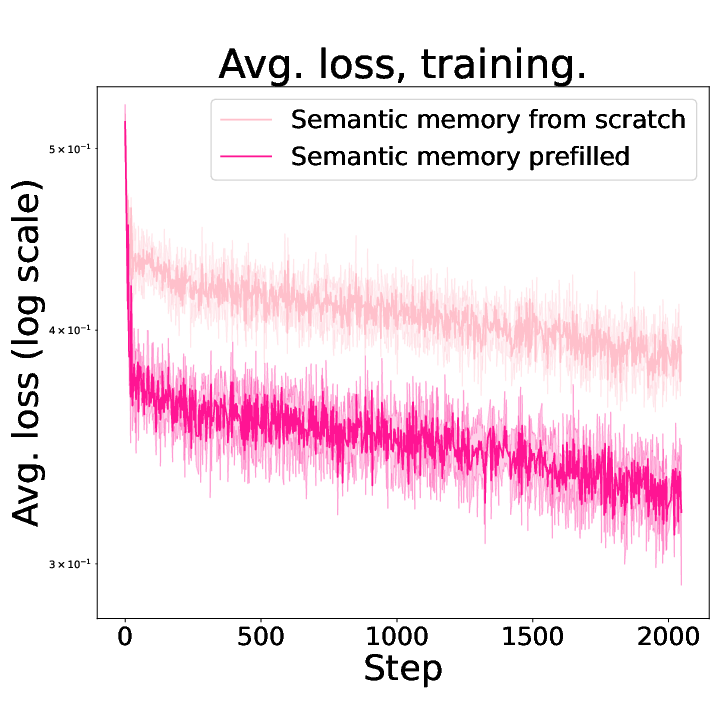
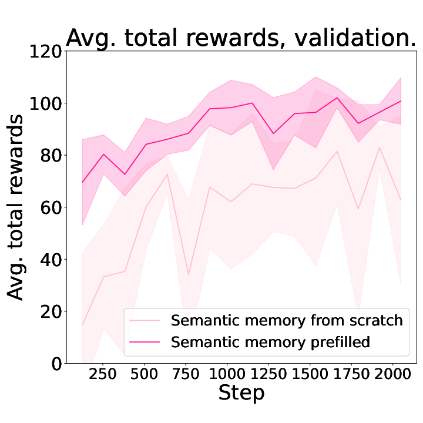
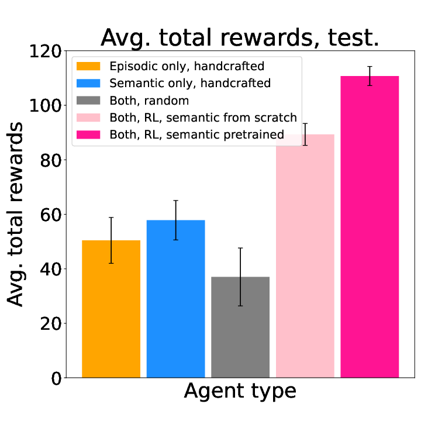
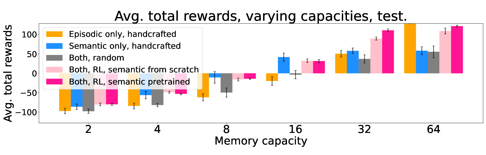

# Explicit Memory

**Authors:** [Taewoon Kim](https://taewoon.kim/), [Michael Cochez](https://www.cochez.nl/), [Vincent Francois-Lavet](http://vincent.francois-l.be/), [Mark Neerincx](https://ocw.tudelft.nl/teachers/m_a_neerincx/), and [Piek Vossen](https://vossen.info/).

Code for a deep-Q-learning agent with explicit short-term, episodic, and semantic memory
that operates in [RoomEnv-v1](https://github.com/humemai/room-env).

For the research overview, see the [project page](https://humem.ai/projects/explicit-memory)
or the paper on [arXiv](https://arxiv.org/abs/2212.02098).

This README focuses on the code, setup, training flow, and results in this repository.

## Repository layout

- [`agent/`](./agent): agent implementation and memory-related components
- [`train.py`](./train.py): runs training in RoomEnv-v1
- [`train.yaml`](./train.yaml): configuration for training runs
- [`models/`](./models): saved models and related outputs
- [`figures/`](./figures): generated plots and analysis figures
- [`paper/`](./paper): paper source and paper figures
- [`test/`](./test): tests

## Prerequisites

1. Python 3.10 or higher
1. A virtual environment is recommended
1. Install the requirements with `pip install -r requirements.txt`

## Run training

```sh
python train.py
```

Configure the training run in [`train.yaml`](./train.yaml). Training outputs, checkpoints,
and derived figures are written into the repository outputs used by the analysis scripts.

## Training setup

The project trains a DQN-based agent that decides what to do with the oldest short-term
memory when the short-term buffer is full.

- forget it
- move it to episodic memory
- move it to semantic memory

The repository includes both a semantic-scratch variant and a semantic-pretrained variant
that starts with ConceptNet-based world knowledge.

## Results

|                 Average loss, training.                 |           Average total rewards per episode, validation.           |              Average total rewards per episode, test.               |
| :-----------------------------------------------------: | :----------------------------------------------------------------: | :-----------------------------------------------------------------: |
|  |  |  |

|           Average total rewards, varying capacities, test.           |
| :------------------------------------------------------------------: |
|  |

Also check [`models/`](./models) for saved training runs and [`paper/`](./paper) for the
paper source and additional figure assets.

## Further reading

- [Project page](https://humem.ai/projects/explicit-memory)
- [Paper on arXiv](https://arxiv.org/abs/2212.02098)
- [RoomEnv-v1](https://github.com/humemai/room-env)

## Cite our paper

```bibtex
@article{Kim_Cochez_Francois-Lavet_Neerincx_Vossen_2023,
  title={A Machine with Short-Term, Episodic, and Semantic Memory Systems},
  volume={37},
  url={https://ojs.aaai.org/index.php/AAAI/article/view/25075},
  DOI={10.1609/aaai.v37i1.25075},
  number={1},
  journal={Proceedings of the AAAI Conference on Artificial Intelligence},
  author={Kim, Taewoon and Cochez, Michael and Francois-Lavet, Vincent and Neerincx, Mark and Vossen, Piek},
  year={2023},
  month={Jun.},
  pages={48-56}
}
```
